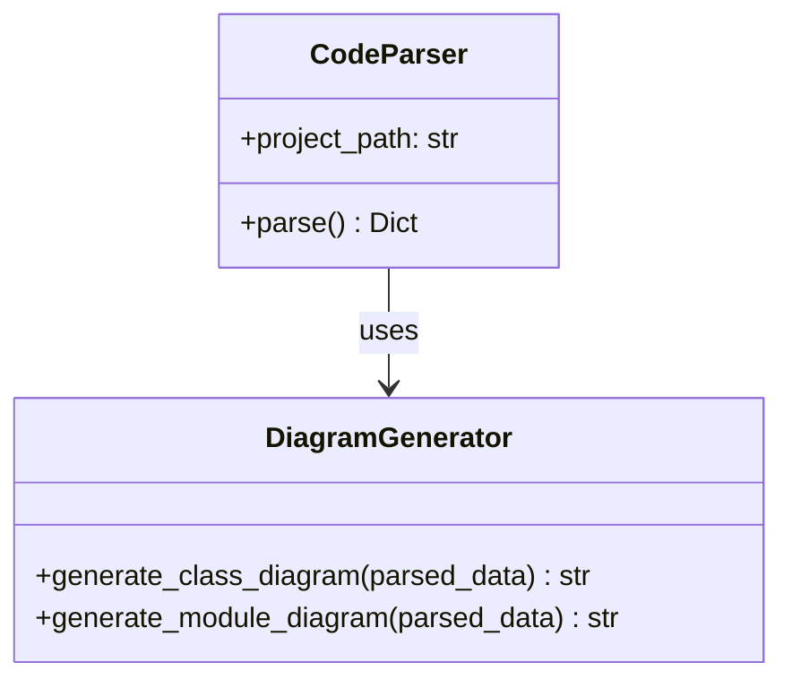
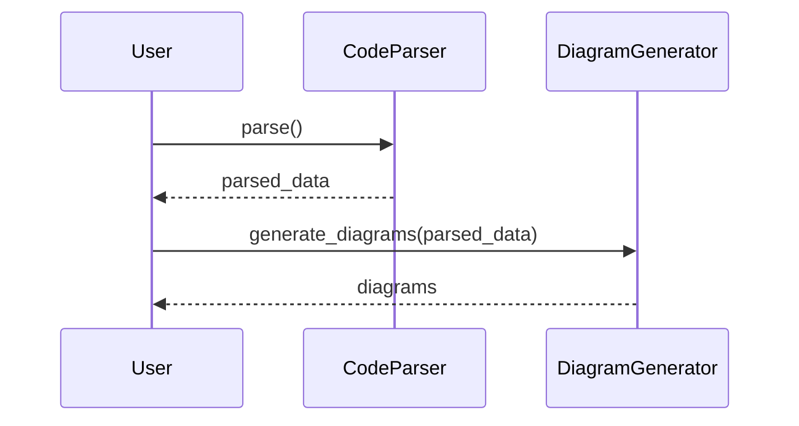

# InsightForge

\
\

**InsightForge** é uma ferramenta avançada para análise e documentação automática de código, com geração de diagramas, detecção de relacionamentos e integração com LLMs.

## Visão Geral

A ferramenta analisa o código-fonte em várias linguagens (Python, PHP, JavaScript/TypeScript) e gera documentação estruturada com diagramas das classes, módulos e fluxos de interação. Usando LLMs, o InsightForge também pode gerar explicações de código e responder a consultas em linguagem natural.

## Recursos Principais

- **Análise Multi-linguagem**: Suporte para Python, PHP, JavaScript e TypeScript
- **Diagramas Automáticos**: Geração de diagramas de classe, módulo e sequência usando sintaxe Mermaid
- **Detecção de Relacionamentos**: Identificação automática de herança, composição, agregação e associações
- **Análise de Fluxo**: Rastreamento de chamadas de método para reconstruir fluxos de execução
- **Integração com LLMs**: Explicações de código e consultas em linguagem natural via integração com Ollama
- **Exportação Flexível**: Exportação para diferentes formatos, incluindo GitHub Pages

## Instalação

```bash
# Via pip
pip install insightforge

# Ou diretamente do GitHub
pip install git+https://github.com/seu-usuario/insight_forge.git
```

## Uso Rápido

```bash
# Analisar um projeto e gerar documentação
insightforge analyze --project ./meu-projeto --output-dir ./documentacao

# Exportar documentação para GitHub Pages
insightforge github-export --docs-dir ./documentacao --project-name "Meu Projeto"

# Publicar documentação no GitHub Pages
insightforge github-publish --docs-dir ./documentacao --repo-url https://github.com/usuario/repo --project-name "Meu Projeto" --setup-actions
```

## Documentação

Para documentação completa, acesse: [https://seu-usuario.github.io/insight_forge/](https://seu-usuario.github.io/insight_forge/)

## Exemplos

### Diagrama de Classe



### Diagrama de Sequência



## Licença

Este projeto está licenciado sob a licença MIT - veja o arquivo [LICENSE](LICENSE) para detalhes.

## Contribuindo

Contribuições são bem-vindas\! Veja [docs/contributing.md](docs/contributing.md) para detalhes sobre como contribuir para este projeto.

## Créditos

Desenvolvido por Tarcisio Bannwart
EOF < /dev/null