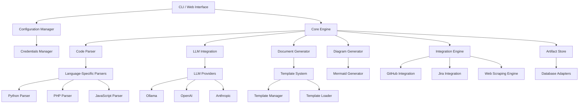
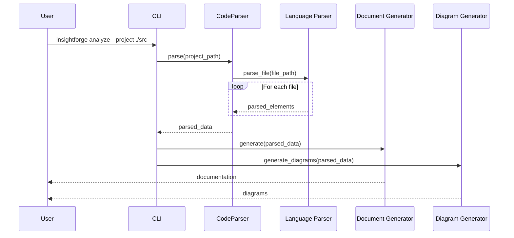
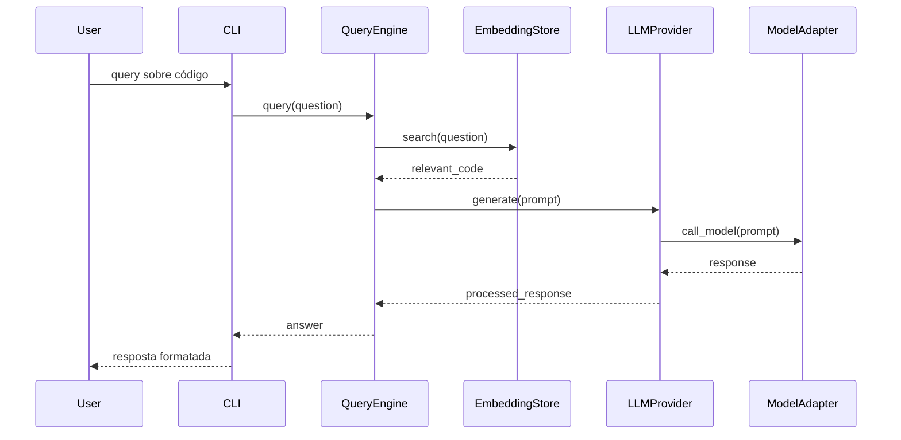
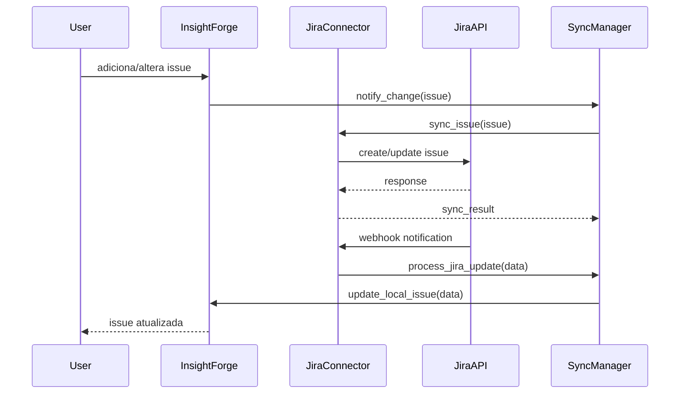

# InsightForge - Arquitetura e Visão Geral

## Introdução

InsightForge é uma plataforma de análise e documentação automatizada de código, com geração de diagramas, detecção de relacionamentos e integração com LLMs. Esta documentação fornece uma visão geral da arquitetura do sistema, seus componentes principais e as interações entre eles.

## Visão Geral da Arquitetura

O InsightForge adota uma arquitetura modular com componentes desacoplados, permitindo extensibilidade e fácil manutenção. A arquitetura segue princípios SOLID e utiliza padrões de projeto como Factory, Strategy, Adapter e Observer.

### Diagrama de Arquitetura de Alto Nível

## Componentes Principais

### 1. Interface da Linha de Comando (CLI)

O ponto de entrada principal é a interface de linha de comando, implementada em `main.py`. Permite ao usuário:

- Analisar projetos de código
- Gerar documentação
- Exportar para GitHub Pages
- Configurar credenciais e preferências

### 2. Sistema de Configuração

Gerencia as configurações do sistema, incluindo credenciais de API, caminhos de projeto e preferências do usuário.

**Módulos Principais:**
- `config_manager.py`: Gerenciamento básico de configuração
- `advanced_config_manager.py`: Configuração avançada com suporte a perfis
- `credentials_manager.py`: Armazenamento seguro de credenciais
- `config_schema.py`: Validação de esquema de configuração

**Abordagens de Configuração:**
- Arquivo YAML para configuração persistente
- Variáveis de ambiente para integração CI/CD
- Interface web e CLI para gerenciamento

### 3. Mecanismo de Análise de Código

O componente central que analisa o código-fonte para extrair informações estruturais.

**Módulos Principais:**
- `code_parser.py`: Orquestrador de análise de código
- Parsers específicos de linguagem:
  - `python_parser.py`: Parser para código Python usando AST
  - `php_parser.py`: Parser para código PHP
  - `javascript_parser.py`: Parser para JavaScript/TypeScript

**Funcionalidades:**
- Detecção de classes, métodos e funções
- Análise de hierarquia e relacionamentos
- Extração de comentários e docstrings
- Análise de dependências entre arquivos

### 4. Geração de Documentação

Transforma os dados analisados em documentação estruturada.

**Módulos Principais:**
- `doc_generator.py`: Geração de documentação
- `template_system.py`: Sistema de templates Jinja2
- `business_rules.py`: Extração de regras de negócio

**Artefatos Gerados:**
- Documentação de classes e funções
- Documentação de regras de negócio
- Índices e páginas de visão geral
- Diagramas integrados em Markdown

### 5. Geração de Diagramas

Cria visualizações gráficas da estrutura do código.

**Módulos Principais:**
- `diagram_generator.py`: Geração de diagramas Mermaid
- `relationship_detector.py`: Detecção de relacionamentos

**Tipos de Diagramas:**
- Diagramas de classe
- Diagramas de módulo/pacote
- Diagramas de sequência para fluxos
- Diagramas de relacionamento

### 6. Integração com LLMs

Fornece capacidades de inteligência artificial para análise e documentação.

**Módulos Principais:**
- `llm/base.py`: Abstração base para LLMs
- `llm/ollama.py`: Integração com Ollama
- `llm/query.py`: Mecanismo de consulta em linguagem natural
- `llm/embeddings.py`: Sistema de embeddings e pesquisa semântica

**Funcionalidades:**
- Consultas em linguagem natural sobre o código
- Geração automática de explicações
- Classificação de código por finalidade
- Extração de regras de negócio implícitas

### 7. Exportação e Integração

Permite a integração com ferramentas e plataformas externas.

**Módulos Principais:**
- `exporters/github_exporter.py`: Exportação para GitHub Pages
- `exporters/github_actions.py`: Configuração de GitHub Actions
- `exporters/github_integration.py`: Integração com API do GitHub

**Novas Integrações:**
- `integrations/jira_integration.py`: Sincronização com Jira
- `integrations/webscraping.py`: Motor de webscraping para análise de UI

### 8. Armazenamento de Artefatos

Sistema de banco de dados para armazenar e relacionar artefatos do projeto.

**Módulos Principais:**
- `artifact_store.py`: Gerenciamento de artefatos
- `link_manager.py`: Gerenciamento de links entre artefatos
- `database_adapters.py`: Adaptadores para diferentes bancos de dados

**Tipos de Artefatos:**
- Classes e funções analisadas
- Regras de negócio
- Casos de uso
- Histórias de usuário
- Telas de UI documentadas

## Padrões de Design

### Padrões Principais

1. **Factory Method**: Criação de parsers específicos de linguagem baseados no tipo do arquivo.

2. **Strategy**: Diferentes estratégias de análise e geração de documentação.

3. **Adapter**: Adaptadores para diferentes provedores LLM.

4. **Observer**: Notificações de mudanças em artefatos.

5. **Command**: Encapsulamento de operações em objetos comando.

6. **Template Method**: Definição de algoritmos com passos personalizáveis.

### Princípios Aplicados

1. **Injeção de Dependência**: As dependências são injetadas, não criadas internamente.

2. **Inversão de Controle**: Dependências em abstrações, não em implementações concretas.

3. **Single Responsibility Principle**: Cada módulo tem uma única responsabilidade.

4. **Open/Closed Principle**: Extensível sem modificação do código existente.

## Fluxos de Dados

### Fluxo de Análise de Código

### Fluxo de Integração com LLM

### Fluxo de Sincronização com Jira

## Extensibilidade

O InsightForge foi projetado para ser facilmente extensível nas seguintes áreas:

### 1. Suporte a Novas Linguagens

Para adicionar suporte a uma nova linguagem:

1. Implementar uma nova classe de parser que herda da classe base
2. Registrar o parser no gerenciador de parsers
3. Adicionar templates específicos da linguagem (opcional)

### 2. Novas Integrações

Para adicionar uma nova integração externa:

1. Implementar um novo módulo de integração usando o padrão adapter
2. Adicionar a configuração necessária ao schema de configuração
3. Registrar a integração no sistema de integração

### 3. Novos Provedores LLM

Para adicionar um novo provedor LLM:

1. Implementar uma classe que herda de `LLMProvider`
2. Implementar os métodos `generate()`, `generate_chat()` e `get_embeddings()`
3. Registrar o novo provedor no sistema de LLM

## Requisitos Técnicos

### Requisitos de Sistema

- **Python**: 3.8 ou superior
- **Espaço em Disco**: Mínimo 100MB (mais espaço para projetos grandes)
- **Memória**: Mínimo 2GB (4GB+ recomendado para projetos grandes)
- **Processador**: Múltiplos núcleos recomendados para análise paralela

### Dependências Principais

- **Jinja2**: Para o sistema de templates
- **PyYAML**: Para manipulação de configuração
- **Rich**: Para saída de console melhorada
- **Cryptography**: Para armazenamento seguro de credenciais
- **Flask**: Para interface web
- **Keyring**: Para gerenciamento de credenciais do sistema
- **Requests**: Para chamadas de API
- **Playwright/Puppeteer**: Para webscraping (opcional)

## Escalabilidade e Performance

### Otimizações

1. **Processamento Paralelo**: Análise de arquivos em paralelo
2. **Caching**: Armazenamento em cache de resultados de análise
3. **Análise Incremental**: Processamento apenas de arquivos alterados
4. **Lazy Loading**: Carregamento sob demanda de recursos pesados

### Estratégias para Projetos Grandes

1. **Particionamento**: Análise por módulos ou pacotes
2. **Paginação**: Geração de diagramas menores e interconectados
3. **Filtragem**: Exclusão de diretórios irrelevantes (ex: node_modules, venv)
4. **Otimização de Memória**: Uso de generators e iteradores

## Segurança

### Considerações de Segurança

1. **Armazenamento Seguro**: Tokens de API e credenciais armazenados de forma segura
2. **Isolamento de Processos**: Execução segura de código externo
3. **Validação de Entrada**: Sanitização de caminhos e entradas do usuário
4. **Permissões Mínimas**: Operação com privilégios mínimos necessários

## Próximos Passos

1. **Cobertura de Linguagens**: Expandir suporte para mais linguagens
2. **Interface Web Avançada**: Dashboard completo para visualização
3. **Integrações**: Adicionar mais sistemas de gestão de projetos
4. **Análise Semântica**: Melhorar a compreensão do código com LLMs
5. **Análise Dinâmica**: Incorporar dados de execução e testes

---

## Apêndice A: Glossário

- **AST**: Abstract Syntax Tree - Representação do código como árvore sintática
- **LLM**: Large Language Model - Modelo de linguagem de grande escala
- **Embedding**: Representação vetorial de texto para busca semântica
- **Mermaid**: Linguagem para criação de diagramas baseados em texto

## Apêndice B: Referências

- [Python AST Documentation](https://docs.python.org/3/library/ast.html)
- [Jinja2 Documentation](https://jinja.palletsprojects.com/)
- [Mermaid Syntax](https://mermaid-js.github.io/mermaid/#/)
- [GitHub API Documentation](https://docs.github.com/en/rest)
- [Jira API Documentation](https://developer.atlassian.com/cloud/jira/platform/rest/v3/)