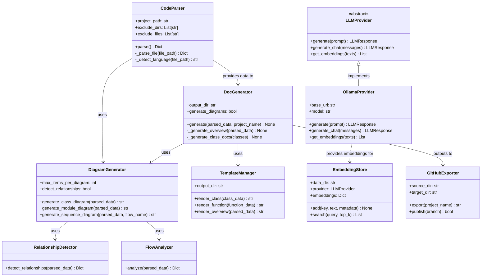
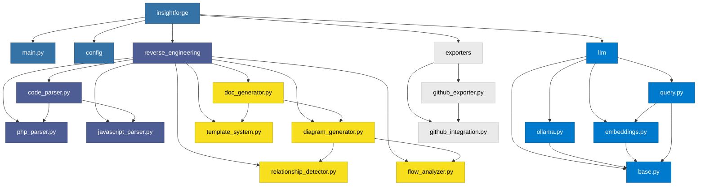
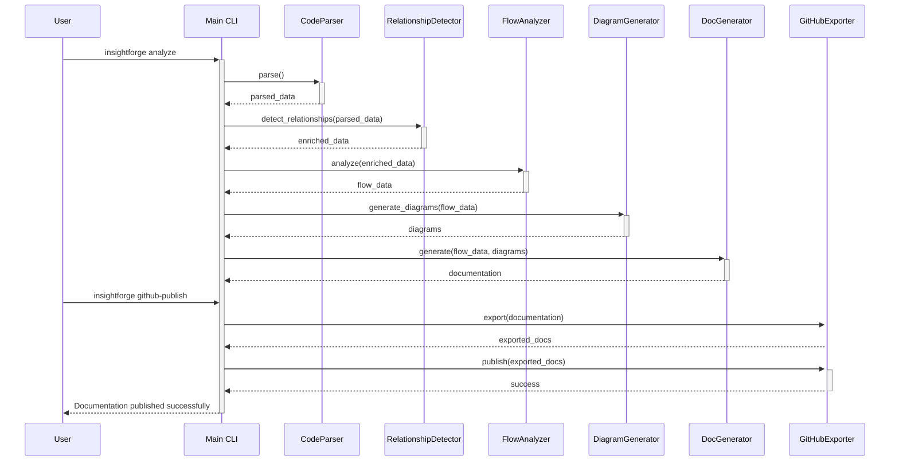

# Diagramas

Esta seção contém os diagramas gerados para o projeto InsightForge.

## Diagrama de Classe

O diagrama abaixo mostra as principais classes do InsightForge e seus relacionamentos:

## Diagrama de Módulos

O diagrama abaixo mostra a estrutura de módulos do InsightForge:

## Diagrama de Sequência

O diagrama abaixo mostra o fluxo de processamento principal do InsightForge:

